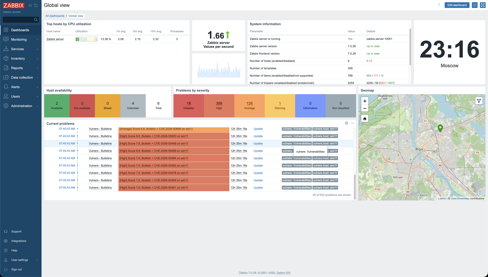
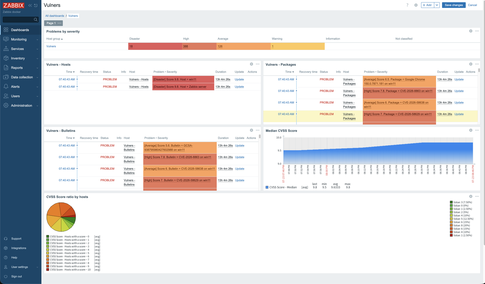
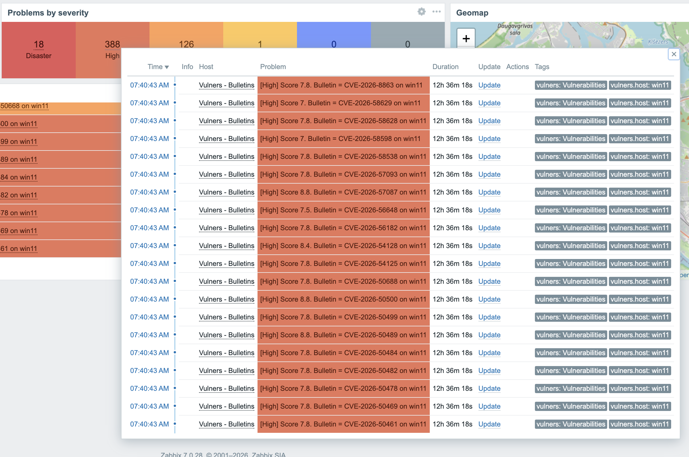
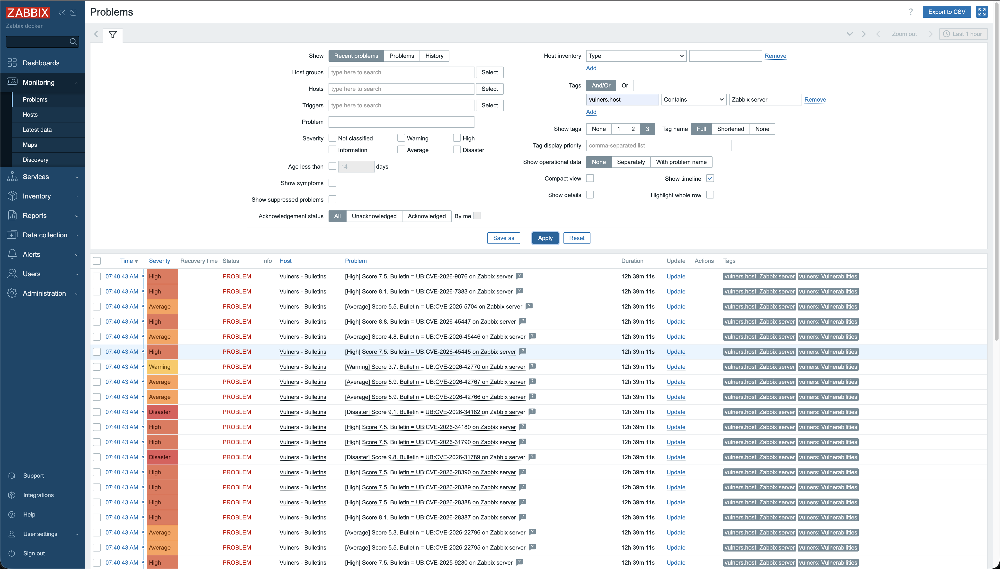
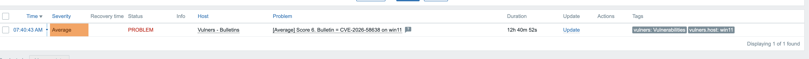

# Zabbix Threat Control (ztc)

**Turn the Zabbix you already run into a vulnerability-management console.**

`ztc` reads each host's software inventory through the stock **zabbix-agent2**
(no extra agent to deploy), audits it against [Vulners](https://vulners.com), and
pushes **scored, per-host findings** — problems, dashboards and CVSS graphs —
back into Zabbix. One static binary, installed in one command.

[](https://github.com/vulnersCom/zabbix-threat-control/actions/workflows/ci.yml)
[](https://github.com/vulnersCom/zabbix-threat-control/releases)
[](LICENSE)



## Why ztc

- **No new agent, no RCE.** Hosts report inventory via standard zabbix-agent2
  `UserParameter`s. Remediation goes through a single whitelisted key + narrow
  sudoers — never arbitrary `system.run`.
- **Linux _and_ Windows.** Linux packages via Vulners `audit/linux`; Windows
  registry software via **Smart Audit** and installed KBs via `audit/kb` (with
  per-CVE CVSS). Smart Audit is independent of the Zabbix version.
- **Zabbix 6.0, 7.0, 7.4 and 8.0.** Auto-detects the API version; no per-version
  branches to maintain on your side.
- **Actionable, not just a list.** Findings become Zabbix **problems scored by
  CVSS severity**, filterable **by host**, with **median-CVSS and
  score-distribution graphs** on a ready-made dashboard.
- **One binary.** Install with a single command; it **self-updates**.

## Quick start

On your Zabbix server (or any Linux host that can reach Zabbix + Vulners):

```sh
curl -fsSL https://raw.githubusercontent.com/vulnersCom/zabbix-threat-control/master/deploy/install.sh | sudo sh
```

The installer asks for your Vulners API key and Zabbix connection, installs a
systemd service, and offers to create the Zabbix entities (`ztc provision --all`).
Then link the collection template to the hosts you want scanned — see
[`docs/guide.md`](docs/guide.md).

Other options (Docker, manual, air-gapped, bootstrap-via-Zabbix):
[`deploy/README.md`](deploy/README.md).

## How it works

```
 hosts: zabbix-agent2  UserParameter
   Linux   → vulners.os / version / arch / packages
   Windows → vulners.os / version / win.software / win.kb
        │   (polled into Zabbix items)
        ▼
   ztc scan ─► collect (Zabbix API) ─► audit (Vulners) ─► aggregate ─► sender ─► Zabbix
                                                                           │
        problems (CVSS severity) · dashboard · graphs · vulners.host tags ◄┘
```

`ztc scan --daemon` runs the loop on a schedule; `ztc provision` creates the
Zabbix template, report hosts, triggers and dashboard.

## What you get in Zabbix

- **Report hosts:** `Vulners - Hosts`, `- Bulletins`, `- Packages`, `- Statistics`.
- **Dashboard** with a **Problems-by-severity** overview, per-report problem
  lists, a **Median CVSS Score** trend and a **CVSS score distribution** pie.
- **Severity-scored problems** — each finding fires at Disaster / High / Average /
  Warning based on its CVSS, so *Problems by severity* is meaningful.
- **Filter by host** — every finding carries a `vulners.host` tag. In *Monitoring
  → Problems* filter `Tags: vulners.host Equals <host>` to see one host's
  vulnerabilities. (One finding = one (vulnerability, host) pair.)

**Median CVSS trend and score distribution across the fleet:**



**Severity breakdown** — real Disaster / High / Average / Warning counts, not one grey "Not classified" bar:



**One host's vulnerabilities** via the `vulners.host` tag filter:



**A single finding** — scored by CVSS, tagged with its host, linked to vulners.com:



## Configuration

Everything has a default; supply secrets via environment variables (they
override the YAML file). Full example: [`config.example.yaml`](config.example.yaml).

| Env | Purpose |
|-----|---------|
| `VULNERS_API_KEY` | Vulners API key (required) |
| `VULNERS_BASE_URL` | self-hosted / proxy Vulners endpoint (optional) |
| `ZABBIX_URL` | Zabbix frontend URL (JSON-RPC API) |
| `ZABBIX_TOKEN` | API token (preferred) … |
| `ZABBIX_USER` / `ZABBIX_PASSWORD` | … or user + password |
| `ZABBIX_SERVER_FQDN` / `ZABBIX_SERVER_PORT` | zabbix-sender target |
| `ZTC_SCHEDULE` | daemon scan interval (e.g. `1h`) |
| `ZTC_MIN_CVSS` | drop findings below this CVSS before creating objects |

`ztc --help` lists the full set.

## Commands

```sh
ztc scan --daemon                 # run the scan loop on a schedule
ztc scan --once                   # a single cycle
ztc provision --all               # create/reconcile templates, report hosts, dashboard
ztc fix --host H --package P      # remediate a package (whitelisted, opt-in)
ztc upgrade                       # self-update, then re-run `provision --all`
ztc version --check               # print version and check for updates
```

## Remediation

`ztc fix` upgrades a vulnerable package via a whitelisted `vulners.fix[<pkg>]`
agent key drained by a host-side worker — no arbitrary command execution. It can
run manually or, with `scan --daemon --auto-fix`, be driven by a trusted user
acknowledging the problem in Zabbix. Rationale:
[`docs/adr/0001-remediation-mechanism.md`](docs/adr/0001-remediation-mechanism.md).

## Support matrix

| | |
|---|---|
| **Zabbix** | 6.0 & 7.0 LTS, 7.4, 8.0 (auto-detected) |
| **OS audited** | Linux (deb/rpm/apk/…), Windows (software + KB) |
| **ztc runs on** | Linux amd64 / arm64 |

## Migrating from the Python version

The original Python implementation remains in this repository's git history
(the commits before the Go rewrite) and in the pre-Go release tags. It shares
the same Zabbix-side names (group, report hosts, dashboard), but collects via
stock agent keys instead of a shipped `report.py`, splits the template in two,
and drops the fix Action. Step-by-step (config mapping, object cleanup, host
re-instrumentation, remediation switch): **[`docs/MIGRATION.md`](docs/MIGRATION.md)**.

## Development

```sh
go build ./...     # compile
go test ./...      # unit tests (no network)
go vet ./... && gofmt -l .
make build         # -> bin/ztc
```

A Docker test stand (Zabbix + agent + ztc) is in
[`deploy/docker/README.md`](deploy/docker/README.md). CI (build/test/lint) runs
on every push; tagging a `v*` commit publishes binaries and a GHCR image.

## License

See [`LICENSE`](LICENSE).
